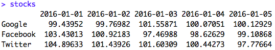
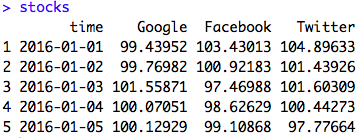
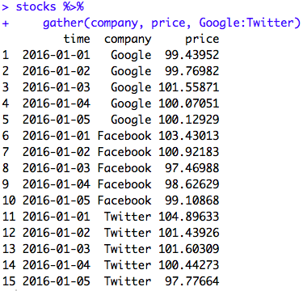

The data analysis process can be thought about in four parts

1. Data cleaning
2. Data transformation 
3. Data visualization
4. Modeling

where we each of these steps need their own tools and software to complete. 


As we have seen in class, one of the most time-consuming aspects of 
the data analysis process is "data wrangling". This is also known 
as "data munging", which is a trendy term for 
_cleaning up a messy data set_. This refers to the first two steps in the 
data analysis process: 

1. Data cleaning (or tidying data)
2. Data transformation 

It can take a long time to clean and transform messy data into a format 
that is useful for data visualization and modeling, but there are tools 
that can help turn messy data into clean data. 

### Defining data structures 

There are many ways to define the structure of a data set. 
Most data frames are made up of **rows** and **columns** where the columns 
are almost always labeled and the rows are *sometimes* labeled. 

For example, a data set could be structured in the following way: 

* each row represents one company (row names are companies)
* each column represent one time point
* the stock prices are defined for each row/column pair



Alternatively, a data set can be structured in the following way:

* each row represents one time point (but no row names)
* the first column defines the time variable and the last three columns contain the stock prices for three companies 



In both cases, the data is the same, but the structure is different. This 
can be  _frustrating_ to deal with because the meaning of the 
values (rows and columns) in the two data sets are different. Providing a 
standardized way of organizing values within a data set would alleviate 
a major portion of this frustration.  


### Defining tidy data

Now, we will introduce the concept of **tidy** data. Tidy data is a 
standard way of mapping the meaning of a dataset to its structure.
The properties of a tidy data set are based on: 

* Each column is a variable
* Each rows is an observation

Working with tidy data is useful because it creates a structured way of
organizing data values within a data set. This makes the data analysis 
process more efficient and simplifies the development of data analysis tools
that work together. In this way, you can focus on the problem you are
investigating, rather than the uninteresting logistics of data.  


### What is `tidyr`?

[`tidyr`](https://cran.r-project.org/web/packages/tidyr/vignettes/tidy-data.html)
is an R package that transforms data sets to a tidy format. 

There are two main functions in `tidyr`: 

* `gather()` = takes multiple columns, and gathers them into key-value pairs  
(it makes "wide" data longer)
* `separate()` = turns a single character column into multiple columns
(it makes "long" data wider)

We'll explore what it means to go between a "wide" and "long" 
data format using `gather()` and `separate()` next. 


### How do I get tidyr? 

To install `tidyr`

```{r, eval=FALSE}
install.packages("tidyr")
```

To load `tidyr` and we'll need `dplyr`

```{r, message=FALSE}
library(tidyr)
library(dplyr)
```

For motivation, a tidy version of the stock data we looked at above
looks like this: (we'll learn how the functions work in just a moment)



In this "tidy" data set, we have three columns representing three variables 
(time, company name and stock price). Every row represents contains one
stock price from a particular time and for a specific company. 

### Pipe operator: %>%

We have introduced the operator: `%>%`. 
dplyr imports this operator from another package (`magrittr` [see help file here](http://cran.r-project.org/web/packages/magrittr/vignettes/magrittr.html)). 
This operator allows you to pipe the output from one function to 
the input of another function. Instead of nesting functions (reading 
from the inside to the outside), the idea of of piping is to read the 
functions from left to right. 

Now in this case, we pipe the `stocks` data frame to the function that will 
gather multiple columns into key-value pairs. 


# Data 

## 2016 Iowa Presidential Caucus 

We will explore [public poll data from HuffPost Pollster](http://elections.huffingtonpost.com/pollster) 
from the 2016 Iowa [Democratic](http://elections.huffingtonpost.com/pollster/2016-iowa-presidential-democratic-caucus) and [Republican](http://elections.huffingtonpost.com/pollster/2016-iowa-presidential-republican-caucus) 
Presidential Caucus.

First we will read in the data:
```{r}
library(readr)
dem_polls = read_csv("http://elections.huffingtonpost.com/pollster/2016-iowa-presidential-democratic-caucus.csv")
rep_polls = read_csv("http://elections.huffingtonpost.com/pollster/2016-iowa-presidential-republican-caucus.csv")
```

Let's take a look at data
```{r, eval=FALSE}
View(dem_polls)
View(rep_polls)

glimpse(dem_polls)
glimpse(rep_polls)
```

We see there is a lot of information in each data frame.  First let's use 
`dplyr` to select a subset of the columns.  
```{r}
dem_polls <- dem_polls %>% 
                select(Pollster, `End Date`, Clinton:Undecided)

rep_polls <- rep_polls %>% 
                select(Pollster, `End Date`, Trump:Walker)
```

In the democratic and republican polling data sets, there is one column 
representing the polling percentages for each candidate, 
similar to the stock price data set with multiple columns 
representing different companies.  To **tidy** it, we need to *gather* these 
columns into a two-column *key-value* pair.  This is often described as 
transforming a _wide_ data set into a _long_ data set.  


# gather()

This function gathers multiple columns and collapses them into new 
*key-value* pairs. This transform data from _wide_ format into 
a _long_ format. 

* The `key` is the name of the _new_ column that you are creating which 
contains the values of the column headings that you are gathering 
* The `value` is the name of the _new_ column that will contain the values
themselves
* The third argument defines the columns to gather

```{r}
dem_polls %>% 
    gather(key = candidate, value = percentage, Clinton:Undecided)
```

To select a range of columns by name, use the ":" (colon) operator

#### Assessment 
Using the democratic poll data, apply the `gather()` function 
to tidy the poll data by _excluding_ the Pollster and End Date columns, 
rather than directly providing the column names to gather.  

Hint: Look at the `gather()` help file on how to exclude column names.

```{r}
## Provide your code here

dem_polls %>% 
    gather(key = candidate, value = percentage, -c(Pollster, `End Date`))

## To select all the columns *except* a specific column, 
## use the "-" (subtraction) operator (also known as negative indexing)
```


#### Assessment
Using the "tidy" democratic poll data, use dplyr to filter for only 
the following candidates (Clinton, Sanders, O'Malley) and for polls 
only ending after May 1, 2015. 

```{r}
## Provide your code here

dem_polls %>% 
    gather(key = candidate, value = percentage, Clinton:Undecided) %>%
    filter(candidate %in% c("Clinton", "Sanders", "O'Malley") & 
           `End Date` >= "2015-05-01")
```

#### Assessment (optional)
Using the tidy and filtered democratic poll data set, 
use `ggplot2` to plot the results from each poll (percentage) for each
of the candiates. Color the lines by the candidate. 

```{r}
## Provide your code here

library(ggplot2)

dem_polls %>% 
    gather(key = candidate, value = percentage, Clinton:Undecided) %>%
    filter(candidate %in% c("Clinton", "Sanders", "O'Malley") & 
           `End Date` >= "2015-05-01") %>% 
    ggplot(aes(x=`End Date`, y = percentage, color = candidate)) + 
    geom_line()
```


#### Assessment (optional) 
Repeat this analysis using the republican poll data. 
Filter for candidates (Trump, Cruz, Rubio, Carson, Bush) 
and for polls only after May 1, 2015. Color the lines by candidates. 

```{r}
## Provide your code here

rep_polls %>% 
    gather(key = candidate, value = percentage, Trump:Walker) %>%
    filter(candidate %in% c("Trump", "Cruz", "Rubio", "Carson", "Bush") & 
           `End Date` >= "2015-05-01") %>% 
    ggplot(aes(x=`End Date`, y = percentage, color = candidate)) + 
    geom_line()
```


# spread()

In contrast to *gathering* multiple columns into key-value pairs, we can 
*spread* a key-value pair across multiple columns.  

The function `spread()` does just that. It transforms data from a _long_
format into a _wide_ format. 

* The `key` is the name of the column in your data set that 
contains the values of the column headings that you are spreading across 
multiple columns
* The `value` is the name of the column that contains the values for the 
multiple columns


```{r}
dem_polls_gathered <- dem_polls %>% 
                         gather(key = candidate, value = percentage, 
                                Clinton:Undecided)
dem_polls_gathered

dem_polls_gathered %>% 
    spread(key = candidate, value = percentage)
```


## Other supporting functions in tidyr

* `separate()` = separate one column into multiple columns
* `unite()` = unite multiple columns into one

```{r}
dem_polls_separate <- dem_polls %>% 
                        separate(col = `End Date`, into = c("y", "m", "d"))
dem_polls_separate
```

#### Assessment

Use the `unite()` function to create a new column titled "end_date" that 
combines the columns `y`, `m` and `d` together into a single column separated 
by the "/" character. 

```{r}
## Provide your code here

dem_polls_separate %>% 
    unite(col = end_date, y, m, d, sep = "/")
```


# Cheatsheets

* [Data Wrangling with dplyr and tidyr from RStudio](https://www.rstudio.com/wp-content/uploads/2015/02/data-wrangling-cheatsheet.pdf)


