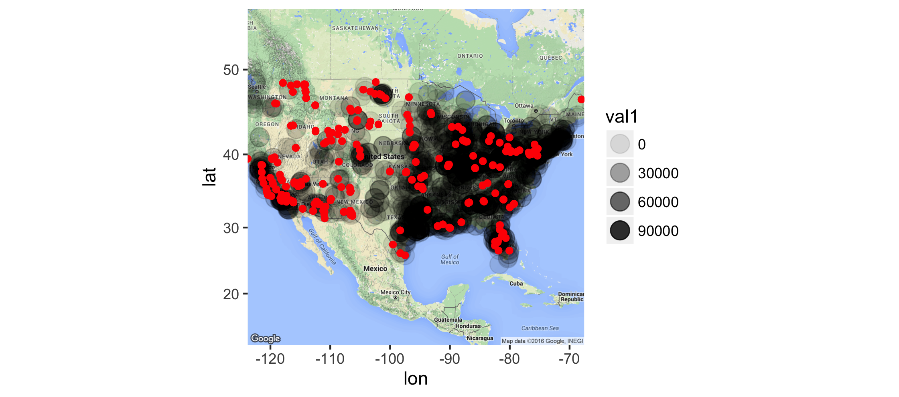
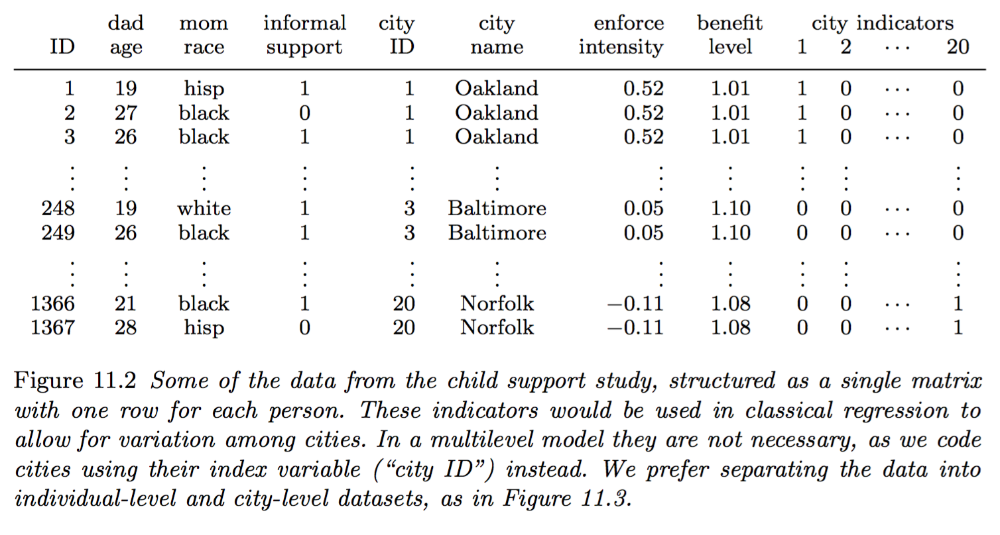
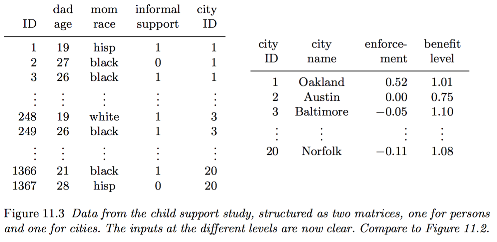

# Motivation: spatial linkage and the Acid Rain Program

- Title IV of the Clean Air Act (1990) sets a goal of reducing annual Sulfur Dioxide (SO2) and Nitrogen oxides (NOX) emissions by 10 million tons (below 1980 levels)

- In the US, roughly 2/3 of all SO2 and 1/4 of all NOx come from electric power generation that relies on burning fossil fuels, like coal

- To achieve these reductions, the law required a two-phase tightening of the restrictions placed on fossil fuel-fired power plants
    - Title IV specified a market-based cap-and-trade system of SO2 allowances: if a plant’s emissions exceeded distributed allotment, allowances could be purchased from other plants
    - Besides allowances, plants could install pollution controls, change fuel, or reduce production

- We have data about power plants and PM 2.5 air pollution monitors:
    - https://github.com/datasciencelabs/data/blob/master/powerplants.csv
    - https://github.com/datasciencelabs/data/blob/master/pm25.csv

- We are going to spatially link power plants to monitors with a 10km range.



    
# Homebrew

http://brew.sh/

From the command line:

```{bash eval = FALSE}
/usr/bin/ruby -e "$(curl -fsSL https://raw.githubusercontent.com/Homebrew/install/master/install)"
brew install postgres
brew install postgis
postgres -D /usr/local/var/postgres
createdb arp
```

### Terminology

- A database (DB) is an organized collection of data.

- A database management system (DBMS) is a software that allows interacting with the database (e.g., storing, retrieving, updating data).

- Relational model (RM).  There are relations between items stored in the database.


- RDBMS = DBMS + RM

- SQL (Structured Query Language) is a language designed to interact with RDBMS.

- IBM in the 1970's (E.F. Codd)

### Illustration

Gelmann & Hill, 2007, Data Analysis Using Regression and Multilevel/Hierarchical Models, Chapter 11.

_Cities and states in the United States have tried a variety of strategies to encourage or force fathers to give support payments for children with parents who live apart. In order to study the effectiveness of these policies for a particular subset of high- risk children, an analysis was done using a sample of 1367 noncohabiting parents from the Fragile Families study, a survey of unmarried mothers of newborns in 20 cities. The survey was conducted by sampling from hospitals which themselves were sampled from the chosen cities, but here we ignore the complexities of the data collection and consider the mothers to have been sampled at random (from their demographic category) in each city._(p. 238)





# RDBMS software solutions

- Commercial
    - Oracle Database
    - Microsoft
    - SQL Server
    - ...
- Open-source
    - MySQL
    - PostgreSQL
    - SQLite
    - ...
    
- SQLite is the easiest way to start: unlike the others, it's not a client-server DB.  The whole DB can live in a (portable) folder.  All the required tools are included in `dplyr`.

- _Lite_ but still powerful.  It barely requires configuration but can still store and process large amounts of data.  It is used in most web browsers and mail clients.

# Why use a RDBMS?

- Data size, typically when the data fits on drive but not in memory

- One DB vs (too) many CSV files

- Data already lives in a DB

- DB provides extra tools, for example a GIS toolbox to deal with spatial data

# SQL

http://www.w3schools.com/sql/

http://www.w3schools.com/sql/sql_quickref.asp

## Verbs

- Common verbs
    - `SELECT`
    - `UPDATE`
    - `DELETE`
    - `INSERT`

- Administrative verbs
    - `CREATE`
    - `ALTER`
    - `DROP`

- Common clauses and keywords
    - `FROM`
    - `WHERE`
    - `GROUP BY`
    - `ORDER BY`

# Data

## mammals sleep revisited

Sleeptimes and weights for 
a set of mammals.

```{r, message=FALSE, warning=FALSE}
library(readr)
library(dplyr)

msleep <- read_csv("https://raw.githubusercontent.com/datasciencelabs/data/master/msleep_ggplot2.csv")
msleep
```

column name | Description
--- | ---
`name` | common name
`genus` | taxonomic rank
`vore` | carnivore, omnivore or herbivore?
`order` | taxonomic rank
`conservation` | the conservation status of the mammal
`sleep_total` | total amount of sleep, in hours
`sleep_rem` | rem sleep, in hours
`sleep_cycle` | length of sleep cycle, in hours
`awake` | amount of time spent awake, in hours
`brainwt` | brain weight in kilograms
`bodywt` | body weight in kilograms

Notice that `dplry` handles the data as `Source: local data frame [83 x 11]`.

## Creating a database and importing data

```{r message=FALSE, warning=FALSE}
library(sqldf)
download.file("https://raw.githubusercontent.com/datasciencelabs/data/master/msleep_ggplot2.csv", "msleep.csv")
## HTTPS not supported in 'file' argument
read.csv.sql(file = "msleep.csv",
             sql = c("ATTACH 'test.sqlite3' AS NEW"))
read.csv.sql(file = "msleep.csv",
             sql = "CREATE TABLE msleep_table AS SELECT * FROM file",
             dbname = "test.sqlite3")
sqldf("SELECT * FROM msleep_table LIMIT 5", dbname = "test.sqlite3")
file.remove("test.sqlite3")
```

## `dplyr` and databases

- https://cran.r-project.org/web/packages/dplyr/vignettes/databases.html

- `dplyr` supports the major open-source databases (MySQL, PostgreSQL, SQLite).

# `dplyr` and databases

To create a first SQLite DB with `dplyr`:

```{r}
db <- src_sqlite("db.sqlite3", create = TRUE)
```

The DB is still empty.  It contains no _tables_.

```{r}
db
```

The DB lives in file "db.sqlite3" in the working directory.  We can now add a table to the DB.

```{r}
msleep_table <- copy_to(db, msleep, temporary = FALSE)
msleep_table
```

The DB now contains:

```{r}
db
```

`dplyr` handles the table as a remote data source: `Source: sqlite 3.8.6 [db.sqlite3]`.

We can pass `SQL` code:

```{r}
tbl(db, sql("SELECT * FROM msleep"))
```

Notice the `??` question marks in data dimensions:

```{txt eval=FALSE}
Source: sqlite 3.8.6 [db.sqlite3]
From: <derived table> [?? x 11]
```

`dplyr` use _lazy evaluation_ and delays data pulling and processing as much as possible:

```{r}
df <- tbl(db, sql("SELECT * FROM msleep"))
dim(df)
```

`df` still has an unknown number of rows and columns can't be accessed the usual way:

```{r}
df$name
```

To force evaluation, `dplyr` provides the `collect` verb:

```{r}
collect_df <- collect(df)
collect_df
```

# `SQL` verb counterparts

```{r}
msleep_table %>% select(name:order)
```

```{r}
msleep_table %>% select(starts_with("sl"))
```

```{r}
tbl(db, sql("SELECT sleep_total, sleep_rem, sleep_cycle FROM msleep"))
```

There is no easy way to use wild cards and select columns by names (http://stackoverflow.com/questions/4797686/selecting-all-columns-that-start-with-xxx-using-a-wildcard).  The following SQL expression selectes on `name` values:

```{r eval=FALSE}
tbl(db, sql("SELECT * FROM msleep WHERE name LIKE ('%sl%')"))
```

It is easy to get the `SQL` code generated by `dplyr`: 

```{r}
msleep_table %>% 
  mutate(rem_proportion = sleep_rem / sleep_total) %>%
  explain()
```

#### Déjà vu assessment

Select all columns that start with the character string "sl" or ends
with the character string "wt", create a new
column called `rem_proportion` which is the ratio of rem sleep 
to total amount of sleep, create a second column `bodywt_grams` which
is the bodywt column in grams and filter for the rows 20 to 30 in 
the msleep data set by numerical position. 

Hint: Look at the `slice()` help file to filter for rows by numerical 
position. 

```{r}
## Provide your code here

msleep_table %>% 
    select(starts_with("sl"), ends_with("wt")) %>%
    mutate(rem_proportion = sleep_rem / sleep_total, 
           bodywt_grams = bodywt * 1000) %>%
  collect() %>% # we need to force evaluation
    slice(20:30)
```

### Create summaries of the data frame using `summarise()`

```{r}
msleep_table %>% 
    summarise(avg_sleep = mean(sleep_total))
```

### Group operations using `group_by()`

```{r}
msleep_table %>% 
  filter(vore == "carni") %>% 
  summarize("bodywt_sd" = mean(bodywt), 
            "brainwt_sd" = mean(brainwt))  %>%
  collect() # no na.rm option
```

```{r}
file.remove("db.sqlite3")
file.remove("msleep.csv")
```

# Joining two data frames with `SQL`

## Data: `oscars` and `movies` again: 2016 Oscars Nominations 

```{r}
library(readr)

oscars <-"
name,movie,category
Adam McKay,The Big Short,Best Director
Alejandro González Iñárritu,The Revenant,Best Director
Lenny Abrahamson,Room,Best Director
Tom McCarthy,Spotlight,Best Director
George Miller,Mad Max: Fury Road,Best Director
Bryan Cranston,Trumbo,Best Actor
Matt Damon,The Martian,Best Actor
Michael Fassbender,Steve Jobs,Best Actor
Leonardo DiCaprio,The Revenant,Best Actor
Eddie Redmayne,The Danish Girl,Best Actor
Cate Blanchett,Carol,Best Actress
Brie Larson,Room,Best Actress
Jennifer Lawrence,Joy,Best Actress
Charlotte Rampling,45 Years,Best Actress
Saoirse Ronan,Brooklyn,Best Actress
"
oscars <- read_csv(oscars, trim_ws = TRUE, skip = 1)

movies <-"
movie,length_mins
The Big Short,130
Star Wars: The Force Awakens,135
Brooklyn,111
Mad Max: Fury Road,120
Room,118
The Martian,144
The Revenant,156
Spotlight,128
"
movies <- read_csv(movies, trim_ws = TRUE, skip = 1)

oscars_table <- copy_to(db, oscars)
movies_table <- copy_to(db, movies)

db
```

## `SQL` join verbs


### inner_join(x,y)

```{r}
inner_join(oscars_table, movies_table, by = "movie")
```

#### Assessment

Try using pure `SQL` instead.

```{r}
## Provide your code here

tbl(db, sql("SELECT * FROM oscars
            INNER JOIN movies
            ON oscars.movie = movies.movie"))
```

or with the `AS` keyword.

```{r eval=FALSE}
## Provide your code here

tbl(db, sql("SELECT * FROM oscars AS O
            INNER JOIN movies as M
            ON O.movie = M.movie"))
```

### semi_join(x,y)

This function returns all rows from x where there are matching values 
in y, keeping just columns from x. A semi join differs from an 
inner join because an inner join will return one row of x for 
each matching row of y, where a semi join will never duplicate 
rows of x.

```{r}
semi_join(oscars_table, movies_table, by = "movie")
```

#### Assessment (tricky)

Write the same query in `SQL` (there is no native `SEMI JOIN` implementation).  Hint:
- `WHERE`: http://www.w3schools.com/sql/sql_where.asp
- `EXISTS`: http://www.w3resource.com/sql/special-operators/sql_exists.php

```{r}
## Provide your code here

tbl(db, sql("SELECT * FROM oscars AS O
            WHERE EXISTS(SELECT 1 FROM movies AS M WHERE O.movie = M.movie)"))
```

### Assessment 

Using the `dplyr` join functions, combine the columns from the 
`oscars` and `movies` data sets and return all rows from the `oscars` data 
set and all columns in both the `oscars` and `movies` columns. 

Hint: read the help file for `left_join()` or `right_join()`. 

```{r}
## Provide your code here

left_join(oscars_table, movies_table, by = "movie")

tbl(db, sql("SELECT * FROM oscars
            LEFT JOIN movies
            ON oscars.movie = movies.movie"))
```

But

```{r eval=FALSE}
right_join(movies_table, oscars_table, by = "movie")
```

```{txt}
Error in UseMethod("right_join") : 
  no applicable method for 'right_join' applied to an object of class "c('tbl_sqlite', 'tbl_sql', 'tbl')"
```

```{r eval=FALSE}
tbl(db, sql("SELECT * FROM oscars
            RIGHT JOIN movies
            ON oscars.movie = movies.movie"))
```

```{txt}
Error in sqliteSendQuery(conn, statement) : 
  error in statement: RIGHT and FULL OUTER JOINs are not currently supported
```

Not all standard `SQL` features are available in `SQLite`: https://www.sqlite.org/omitted.html

### full_join(x,y)

This function returns all rows and all columns from both x and y. 
When there are not matching values, it will return NA for the one missing. 

```{r eval=FALSE}
full_join(oscars, movies, by = "movie")
full_join(oscars_table, movies_table, by = "movie")
```

```{txt}
Error in UseMethod("full_join") : 
  no applicable method for 'full_join' applied to an object of class "c('tbl_sqlite', 'tbl_sql', 'tbl')"
```

Not available in `SQLite` either.

```{r eval=FALSE}
tbl(db, sql("SELECT * FROM oscars
            FULL OUTER JOIN movies
            ON oscars.movie = movies.movie"))
```

```{txt}
Error in sqliteSendQuery(conn, statement) : 
  error in statement: RIGHT and FULL OUTER JOINs are not currently supported
```

Tricks can be used (http://sqlite.awardspace.info/syntax/sqlitepg06.htm).

```{r}
tbl(db, sql("SELECT * FROM oscars LEFT OUTER JOIN movies ON movies.movie = oscars.movie
            UNION
            SELECT * FROM movies LEFT OUTER JOIN oscars ON oscars.movie = movies.movie")) %>% collect() %>%
  as.data.frame() %>% na.omit() %>% unique() -> d
dim(d)
```

### Assessment (tricky)

Replicate the `dplyr` `anti_join()` functions to return all rows from `oscars` data set 
where there are not matching values in `movies`, only keeping the 
columns from the `oscars` data set.

Hint: http://blog.montmere.com/2010/12/08/the-anti-join-all-values-from-table1-where-not-in-table2/

```{r}
## Provide your code here
anti_join(oscars_table, movies_table, by = "movie")

tbl(db, sql("SELECT * FROM oscars AS O 
            LEFT JOIN movies AS M
            ON O.movie = M.movie
            WHERE M.movie IS NULL"))
```

```{r}
tbl(db, sql("SELECT * FROM oscars AS O 
            WHERE NOT EXISTS 
            (SELECT 1 FROM movies AS M WHERE O.movie = M.movie)"))
```

# `ggmap`

Let's get the power plant and PM 2.5 monitor datasets:

```{r}
power_plants <- read.csv("https://raw.githubusercontent.com/datasciencelabs/data/master/powerplants.csv")
pm25 <- read.csv("https://raw.githubusercontent.com/datasciencelabs/data/master/pm25.csv")
```

`ggmap` provides tools to visualize data on static maps using a `ggplot2` type of grammar.

```{r}
library(ggmap)
map <- get_map("US", zoom = 4)
p <- ggmap(map) +
  geom_point(data = power_plants, aes(x = lon1, y = lat1, alpha = val1), size = 5) +
  geom_point(data = pm25, aes(x = lon2, y = lat2), color = "red") 
  
p
# ggsave("pics/all.png", p)
```

### Leaflet

For interactive maps, https://rstudio.github.io/leaflet/ allows for using the `Leaflet` javascript library from R.  It is also possible to integrate these maps into Shiny applications (https://rstudio.github.io/leaflet/shiny.html).

```{r}
library(leaflet)

leaflet(data = pm25) %>% addTiles() %>%
  addMarkers(~lon2, ~lat2, popup = ~as.character(val2))
```

### Question

Spatial linkage: How can we identify power plants within 10km of a PM25 monitor?

# PostgreSQL and PostGIS

http://www.postgresql.org/download/

## Coordinate Reference Systems

https://www.nceas.ucsb.edu/~frazier/RSpatialGuides/OverviewCoordinateReferenceSystems.pdf

## Create a spatial database

Replace `cchoirat` with your username (`whoami` from the command line on Unix-like systems).

```{r eval=FALSE}
library(DBI)
library(dplyr)
system("whoami")
db_arp <- dplyr::src_postgres(dbname = "arp", host = "localhost", port = "5432", user = "cchoirat")
copy_to(dest = db_arp, df = power_plants, "power_plants", temporary = FALSE)
copy_to(dest = db_arp, df = pm25, "pm25", temporary = FALSE)
```

```{r}
db_arp <- dplyr::src_postgres(dbname = "arp", host = "localhost", port = "5432", user = "cchoirat")
```


```{r eval=FALSE}
dbSendQuery(db_arp$con, "CREATE EXTENSION POSTGIS")
dbSendQuery(db_arp$con, "CREATE EXTENSION POSTGIS_topology")
dbSendQuery(db_arp$con, "SELECT PostGIS_full_version()")

dbGetQuery(db_arp$con, "ALTER TABLE power_plants ADD COLUMN gid serial PRIMARY KEY;")
dbGetQuery(db_arp$con, "ALTER TABLE power_plants ADD COLUMN geom geometry(POINT, 4269);")
dbGetQuery(db_arp$con, "UPDATE power_plants SET geom = ST_SetSRID(ST_MakePoint(lon1, lat1), 4269);")
dbGetQuery(db_arp$con, "ALTER TABLE power_plants ADD COLUMN location geography(Point, 4269);;")
dbGetQuery(db_arp$con, "UPDATE power_plants SET location = ST_SetSRID(ST_MakePoint(lon1, lat1), 4269);")

dbGetQuery(db_arp$con, "ALTER TABLE pm25 ADD COLUMN gid serial PRIMARY KEY;")
dbGetQuery(db_arp$con, "ALTER TABLE pm25 ADD COLUMN geom geometry(POINT, 4269);")
dbGetQuery(db_arp$con, "UPDATE pm25 SET geom = ST_SetSRID(ST_MakePoint(lon2, lat2), 4269);")
dbGetQuery(db_arp$con, "ALTER TABLE pm25 ADD COLUMN location geography(Point, 4269);;")
dbGetQuery(db_arp$con, "UPDATE pm25 SET location = ST_SetSRID(ST_MakePoint(lon2, lat2), 4269);")
```

```{r eval=FALSE}
q <- "CREATE TABLE link AS SELECT DISTINCT power_plants.id1, pm25.id2, ST_Distance(power_plants.location, pm25.location) / 1000 AS Distance
FROM power_plants
JOIN pm25 ON ST_DWithin(power_plants.location, pm25.location, 10000)
ORDER BY Distance;"

db_arp$con %>%
  dbGetQuery(q)
```

```{r}
link <- tbl(db_arp, "link") %>% collect()
link
```

If we want to remove tables from the `arp` database:

```{r eval=FALSE}
db_arp$con %>%
  db_drop_table(table = "power_plants")

db_arp$con %>%
  db_drop_table(table = "pm25")

db_arp$con %>%
  db_drop_table(table = "link")
```

## Merging back

```{r}
power_plants_subset <- inner_join(power_plants, link, by = "id1")
pm25_subset <- inner_join(pm25, link, by = "id2")
```

```{r}
library(ggmap)
map <- get_map("US", zoom = 4)
p <- ggmap(map) +
  geom_point(data = power_plants_subset, aes(x = lon1, y = lat1, alpha = val1), size = 5) +
  geom_point(data = pm25_subset, aes(x = lon2, y = lat2), color = "red") 
  
p
# ggsave("pics/subset.png", p)
```

#### Assessment

Implement the same linkage strategy in pure R using spatial libraries (`sp`, `fields`, ...).

# Beyond R and DB's

- With Python
    - http://www.sqlalchemy.org/
    - http://initd.org/psycopg/ (PostgreSQL)
    
- Google’s BigQuery: https://cloud.google.com/bigquery/ (also from `dplyr`)

- `NoSQL`: https://en.wikipedia.org/wiki/NoSQL

```{txt echo =FALSE}
rm -rf /usr/local/var/postgres && initdb /usr/local/var/postgres -E utf8

pg_ctl -D /usr/local/var/postgres -l logfile start
```

