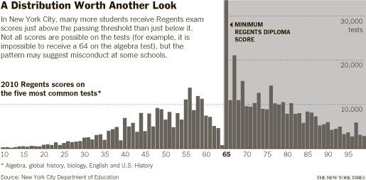
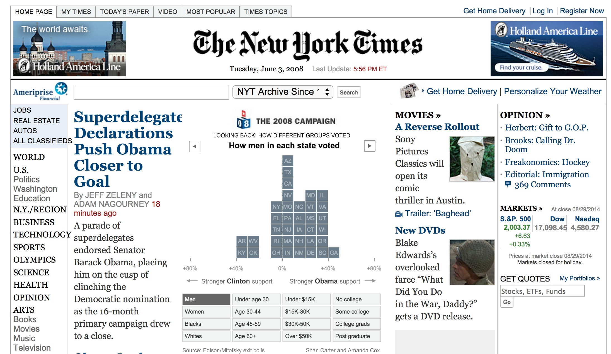

# Data Visualization

## Introduction

"The greatest value of a picture is when it forces us to notice what we never 
expected to see." -John W. Tukey


Mistakes, biases, systematic errors and unexpected variability are commonly 
found in data regardless of applications. Failure to discover these problems 
often leads to flawed analyses and false discoveries. As an example, 
consider that measurement devices sometimes fail and not all summarization 
procedures, such as the `mean` function in R, are designed to detect these. 
Yet, these functions will still give you an answer. Furthermore, it may 
be hard or impossible to notice an error was made just from the 
reported summaries. 

Data visualization is a powerful approach to detecting these problems. 
We refer to this particular task as _exploratory data analysis_ (EDA).
Many important methodological contributions to existing techniques in
data analysis were initiated by discoveries made via EDA.

On a more positive note, data visualization can also lead to discoveries 
which would otherwise be missed if we simply subject the data to a 
battery of statistical summaries or procedures. Through this course, 
we make use of exploratory plots to motivate the analyses we choose. 

Finally, data visualization can provide a powerful way to communicate 
a data-driven finding. In some cases, the visualization is so convincing, 
that no follow-up is required. Many examples of this have appeared 
in the New York Times. The following three examples were provided 
by Amanda Cox, a data scientist that is responsible for most of the [infographics](http://www.nytimes.com/interactive/2009/11/06/business/economy/unemployment-lines.html) 
we see in The New York Times. Both examples are basically histograms.


#### NYC Regents Exam

In New York City you need a 65 to pass the Regents exam. Data on these 
scores are collected for several reasons. A histogram of the 
test scores of grades from NYC Regents Exam tells an interesting story. 
The histogram of these test scores _forces us to notice_ 
something somewhat problematic:




#### Voting patterns
The following histogram helps us understand voting patterns. 
The original 
[infographic](http://www.nytimes.com/packages/html/newsgraphics/pages/hp/2008/2008-06-03-1800.html) 
is actually interactive. The following is a screenshot of one 
of the many histograms one can view:




#### Tax rates by company

[Here]("http://www.nytimes.com/interactive/2013/05/25/sunday-review/corporate-taxes.html") 
is another example of an advanced visualization based on the histogram idea.

We have already introduced some EDA approaches for _univariate_ data,
namely the histograms and qq-plots. Here we provide more details and 
introduce some tools and summary statistics for paired data. 
We do this using the `ggplot2` package and much of the focus of this 
part is introducing this powerful tool.


## Motivating Example: Global Health and Economic Data

Throughout this section we will be analyzing global health and 
economic data. We will be exploring two questions: 

1. Is there a relationship between life expectancy and GDP per capita?
2. How has the GDP per capita distribution changed across time?

We will use the data that has been organized and delivered in the 
`gapminder` package available in an 
[R package from Jenny Bryan](https://github.com/jennybc/gapminder).  


To install the `gapminder` data set

```{r, eval = FALSE}
library(devtools)
install_github("jennybc/gapminder")
```


## Loading data into R

We start by loading the data. We will be using `dplyr` to manipulate the 
data, so we load that as well.

```{r, message=FALSE}
library(dplyr)
library(gapminder)
```

We can take a quick peak at the loaded `gapminder` object:

```{r}
gapminder           ## returns the first 10 rows because it is a `tbl_df`
str(gapminder)
```

This package provides a subset of the data provided by 
[Gapminder](http://www.gapminder.org/data/). The data comes as a 
data frame (or `tbl_df` if you're using `dplyr`). We can visit 
[Gapminder.org documentation page](http://www.gapminder.org/data/documentation/) 
to obtain information about the columns:

| variable  | meaning                  |
|:----------|:-------------------------|
| country   |                          |
| continent |                          |
| year      |                          |
| lifeExp   | life expectancy at birth |
| pop       | total population         |
| gdpPercap | per-capita GDP           |


## ggplot2

[`ggplot2`](http://ggplot2.org) is a powerful data exploration and 
visualization package that can create graphics in R. It was created by 
[Hadley Wickham](http://had.co.nz) when he was a graduate student at 
Iowa State University and is based on the principals defined in the 
[Grammar of Graphics](http://www.amazon.com/The-Grammar-Graphics-Statistics-Computing/dp/0387245448).  


#### Why is it useful?

The idea of the Grammar of Graphics is to break the graph into components 
and handle the components of a graph separately. The `ggplot2` package 
contains a set of functions that allow us to build the features of the
graph in a series of layers for versatility and control. 

There are two main plotting functions in `ggplot2`: 

* `qplot()` = a quick plot, similar to the `plot()` function in base R
* `ggplot()` = a "grammar of graphics" (gg) plot which is made up two 
components (a `ggplot()` object and at least one `geom` layer)

First we will install and load `ggplot2`:

```{r}
#install.packages("ggplot2", dependencies = TRUE)
library(ggplot2)
```

then we will explore the differences between `qplot()` and `ggplot()`. 


## Life expectancy and GDP per capita

To try and answer our first question we will make a _scatterplot_. 
We will do this for the latest entry in our database which is:

```{r}
max( gapminder$year )
```

We will first make a quick plot of these two variables. 

#### `qplot`

The `qplot` function  allows us to produce simple plots, similar to 
`plot` in base R.  The main input of `qplot` is an `x` and `y` argument, 
but it also accepts a data set (`data`) where the `x` and `y` variables are 
located.  

To create a scatter-plot of life expectancy versus GDP per capita 
for 2007, we start by creating a subset of the data with only the 2007 year.

```{r}
dat <- filter(gapminder, year==2007)
```

Why does this not work?

```{r,eval=FALSE}
qplot(x = gdpPercap, y = lifeExp) 
```

We need to specify where to get these values from. Instead, we can
use the vectors of `dat` directly

```{r}
## need to specify where variables are located
qplot(x = dat$gdpPercap, y = dat$lifeExp) 
```

However, a cleaner way to do this does not define `dat` and instead uses the `data` argument:
```{r}
## instead of having to specify name of data frame each time, just list it once
qplot(x = gdpPercap, y = lifeExp, data = filter(gapminder, year==2007))
```


Assessment: Read the help file for `qplot`. What is the argument used to add a label to the x-axis?

Assessment: What is the argument used to add a label to the y-axis?

Assessment: What is the argument used to add a label to the title?

```{r}
qplot(x = gdpPercap, y = lifeExp, 
      data = filter(gapminder, year==2007), 
      xlab = "GDP per Capita", 
      ylab = "Life Expectancy", 
      main = "Data from Gapminder")
```

From this plot, we see that there is a wide variability in life expectancy 
for the lower income countries and then somewhat of a positive trend. However, there are many countries with incomes below 5,000 dollars per 
person and it is hard to see differences between these. Next we will now learn about the grammar of graphics and create a series of visualizations.


## `ggplot`

This function is the implementation of the "Grammar of Graphics" that allows us to build layers of graphical elements to produce plots. As explained by Hadley Wickham

> the grammar tells us that a statistical graphic is a mapping from data to aesthetic attributes (colour, shape, size) of geometric objects (points, lines, bars). The plot may also contain statistical transformations of the data and is drawn on a specific coordinates system.

#### Terminology 
* **ggplot** - the main function where you specify the data set and variables to plot (this is where we define the `x` and
`y` variable names)
* **geoms** - geometric objects
    * e.g. `geom_point()`, `geom_bar()`, `geom_line()`, `geom_histogram()`
* **aes** - aesthetics
    * shape, transparency, color, fill, linetype
* **scales** - define how your data will be plotted
    * continuous, discrete, log, etc

There are three ways to initialize a `ggplot()` object. 

An empty ggplot object
```{r}
p <- ggplot()         
```

A ggplot object associated with a dataset
```{r}
p <- ggplot(filter(gapminder, year==2007))
```
or a ggplot object with a dataset and `x` and `y` defined

```{r}
p <- ggplot(filter(gapminder, year==2007),aes(x=gdpPercap, y = lifeExp))  
```

```{r, eval = FALSE}
p
```

#### Creating your first ggplot()

We just used the function `aes()` which is an aesthetic mapping 
function inside the `ggplot()` object. We use this function to 
specify plot attributes (e.g. `x` and `y` variable names) that 
will not change as we add more layers.  

Anything that goes in the `ggplot()` object becomes
a global setting.  From there, we use the `geom` objects to add 
more layers to the base `ggplot()` object. 
These will define what we are interested in 
illustrating using the data.  

Earlier we noticed that there are many countries with incomes below 5,000 dollars per 
person and it is hard to see differences between these. We can examine just this variable with a histogram. Here we would use a different geometry:

```{r}
p <- ggplot(filter(gapminder, year==2007),
            aes(gdpPercap)) 
p2 <- p + geom_histogram()
```

Here we get a message telling us that the number of bins was chose to be 30. How can we change it?

Assessment: Read the help file for `geom_histogram` and make a histogram with smaller bins:
```{r}
p  + geom_histogram(binwidth=1000)
```

The histogram shows very large tails. We may do better by transforming the data. For data like this, the log transformation seems to work well. It also has a nice economic interpretation related to percent growth: in $log_10$ a change of 1 means the country is 10 times richer.

So how do we make the x-axis in the log scale? It is convenient to have [this](https://www.rstudio.com/wp-content/uploads/2015/03/ggplot2-cheatsheet.pdf) cheat sheet around when using ggplot2. From there we see that `scale_x_log10` does what we want.

```{r}
p <- ggplot(filter(gapminder,year==2007), aes(gdpPercap)) + geom_histogram(bins=25) + scale_x_log10()
p
```
We no longer see extreme tails. The scatter plot now looks much more informative:

Assessment: Remake the scatter plot but now make sure the x-axis is in a log-scale
```{r}
p <- ggplot(filter(gapminder, year==2007), 
            aes(gdpPercap, y=lifeExp)) 
p + geom_point() + scale_x_log10()
```

We can also do this:
```{r}
p2 <- ggplot(filter(gapminder, year==2007), 
            aes(log10(gdpPercap), y=lifeExp)) 
p2 + geom_point()
```


The first day we showed how to create a figure like this but with names. Now we can understand that code:

```{r}
library(ggrepel)
p + geom_point(color = 'red') +
  geom_text_repel(aes(label = country)) +
  scale_x_log10() +
  theme_classic(base_size = 16) 
```

## Stratification

One of the most powerful operation we perform in EDA relates to stratifying the data. 

When we are examining the relationship between two variables, it is possible that another variable is clouding the relationship. For example, for the data we are examining here, it is possible that what drives the apparent relationship is continent. For example, that OECD countries are both rich and healthy, but that within continent there is no relationship between income and life expectancy.  By stratifying the data and re-examine the plot we can check for this possibility. We will learn other ways to do this, but a simple  way we can stratify is by using different colors. Here is the same plot with color representing continent.

```{r}
p <- ggplot(filter(gapminder, year==2007), 
            aes(gdpPercap, y=lifeExp)) 
p + geom_point(aes(color=continent)) + scale_x_log10()
```

Note that this plot reveals that the relationship is indeed weaker within Africa. Although it seems that the trend still holds. Next we learn about faceting which helps us visualize if in fact the different continents are driving this.


#### Facets

We can examine different strata by 
faceting. The idea is simply to split up your data by one or more variables and then plot the subsets of data together. The `facet_wrap` function gives us flexibility on how this happens. Here is an example


```{r}
p + geom_point() +
  facet_wrap("continent") + scale_x_log10()
```

To take a closer look, letting the scale of the axis change, we can add the following argument:

```{r}
p + geom_point() +  
  facet_wrap(~continent, scale="free") + scale_x_log10()
```

Assessment: Examine the relationship for years 1952, 1962, ..., 2002. Use color to distinguish the continents.
```{r}
years <- seq(1952,2002,10)
p2 <- ggplot(filter(gapminder, year %in% years),
             aes(x=gdpPercap,y=lifeExp))
p2 + geom_point(aes(color=continent)) + facet_wrap(~year) + scale_x_log10()
```

Assessment. The points seem a bit small. Read the cheat sheet and learn how to increase the size of points.

```{r}
years <- seq(1952,2002,10)
p2 <- ggplot(filter(gapminder, year %in% years),
             aes(x=gdpPercap,y=lifeExp))
p2 + geom_point(aes(color=continent), size=2) + facet_wrap(~year) + scale_x_log10()
```


These plot clearly shows that the relationship is still present in each continent and year to year.

#### Boxplot

Stratifying and the creating boxplot is one of the most useful forms of EDA. For example, we can 

```{r}
p2 <- ggplot(filter(gapminder, year==2007), 
            aes(continent, y=gdpPercap)) 
p2 + geom_boxplot() + scale_y_log10()
```

```{r}
p2 <- ggplot(filter(gapminder, year%in%years & country!="Kuwait"), 
            aes(continent, y=gdpPercap)) 
p2 + geom_boxplot(aes(fill=continent)) + facet_grid(.~year)+scale_y_log10()
```

```{r}
p2 <- ggplot(filter(gapminder, year%in%years & country!="Kuwait"), 
            aes(continent, y=gdpPercap)) 
p2 + geom_jitter(aes(color=continent)) + facet_grid(.~year)+scale_y_log10()
```

## Densities

```{r}
p2 <- ggplot(filter(gapminder, year==1967 & country!="Kuwait"), 
            aes(x=gdpPercap/365)) 
p2 + geom_histogram() + scale_x_log10()
p2 + geom_density() + scale_x_log10()
```

```{r}
p2 <- ggplot(filter(gapminder, year%in%c(1967,2007) & country!="Kuwait" & continent%in%c("Europe","Asia")), 
            aes(x=gdpPercap/365,fill=continent) )
p2 + geom_density(alpha=.3) + scale_x_log10()
p2 + facet_grid(~year)+geom_density(alpha=.3) + scale_x_log10()
```

# Cheatsheets

* [Data Visualization with ggplot2 from RStudio](https://www.rstudio.com/wp-content/uploads/2015/03/ggplot2-cheatsheet.pdf)
