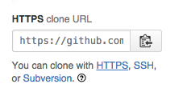
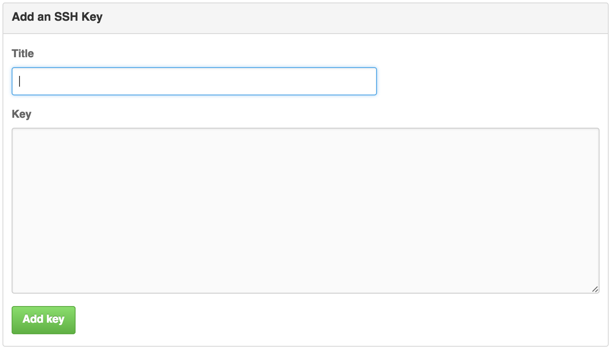

Starting with homework 2 in BIO 260 and CSCI E-107, we will be using a 
specific tool to submit homework assignments, other than Canvas. 
The tool we will be using is called git and GitHub. 
This is a tutorial that will help you 
install the tool git on your computer and create a GitHub account. Once
you have set up git on your computer and registered for a GitHub account, 
you will be prepared for lecture on Wednesday Feb 10, 2016 where we 
will: 

1. Introduce you to the basics of git and GitHub
2. Walk you thought the homework submission process using git and GitHub

#### Acknowledgements 
This lab is largely taken from the the 
[first CS109 lab in 2015](https://github.com/cs109/2015lab1) which is 
in turn largely taken from 
[IACS's AC 297s](https://github.com/rdadolf/ac297r-tools-tutorial) course, 
and the world keeps turning. 

## Create your GitHub account

The first week of class we asked each of you to set up your GitHub account
and submit your GitHub username in [this survey that was due 
Jan 29, 2016](http://goo.gl/forms/sxqUPZKfUf). 
If you have not done this yet, please fill out the survey 
as soon as possible. **Othewise, you will not be able to submit 
your homework assignments starting with HW2.**

To sign up for an account, just go to [github](https://github.com) 
and pick a unique username, an email address, and a password. 
Once you've done that, your github page will be at 
`https://github.com/<your-username-here>`.

Github also provides a student 
[developer package](https://education.github.com/pack). 
This is something that might be nice to have, but it is not 
necessary for the course. Github may take some time to approve 
your application for the package. Please note that this is 
optional and you do not have to have the package 
approved to fill out the survey. 

#### Programming expectations

All the lecture material and homework for this class will use R and
R Markdown files. Knowledge of R is not a prerequisite for this course, 
**provided you are comfortable learning on your own as needed**. 
Basically, you should feel comfortable with:

* How to look up R syntax on Google and StackOverflow.
* Basic programming concepts like functions, loops, arrays, dictionaries, strings, and if statements.
* How to learn new libraries by reading documentation.
* Asking questions on Canvas forums and StackOverflow.

## Setting up your git environment

### 1. Installing git

We will be using the [command line version of git](http://git-scm.com/docs/gittutorial).

On Linux, install git using your system package manager (yum, apt-get, etc). 

On the Mac, if you ever installed [Xcode](https://developer.apple.com/xcode/),
you should have git installed. Alternatively, you may have installed 
it using `homebrew`. Either of these are fine as long as the 
git version is greater than 2.0. To determine the version of git 
that is installed on your computer, open a terminal window and type:

> $ `git --version`

If git is installed, you should see a version number. Check to see if it 
is greater than version 2.0. If it is not, please update your version 
of git. 

If git is not installed on your Mac and Windows, go to http://git-scm.com. 
Accept all defaults in the installation process. 
On Windows, installing git will also install for you a minimal 
unix environment with a "bash" shell and terminal window. 
Voila, your windows computer is transformed into a unixy form.

#### Windows specific notes

There will be an installer `.exe` file you need to click. Accept all the defaults.

Here is a screen shot from one of the defaults. It makes sure you will have the "bash" tool talked about earlier.

Choose the default line-encoding conversion:

Use the terminal emulator they provide, its better than the one shipped with windows.

Towards the end, you might see a message like this. It looks scary, but all you need to do is click "Continue"

At this point you will have git installed. You can bring up "git bash" 
either from your start menu, or from the right click menu on any 
folder background. When you do so, a terminal window will open. 
This terminal is where you will issue further git setup commands, 
and git commands in general.

Get familiar with the terminal. It opens in your home folder, and 
maps `\\` paths on windows to more web/unix like paths with '/'. 
Try issuing the commands `ls`, `pwd`, and `cd folder` where folder 
is one of the folders you see when you do a ls. You can do 
a `cd ..` to come back up.

#### Mac specific notes

As mentioned earlier, if you ever installed Xcode or the 
"Command Line Developer tools", you may already have git.
Make sure its version 2.0 or higher. (`git --version`)

Or if you use **Homebrew**, you can install it from there. 
The current version on homebrew is 2.4.3
 You don't need to do anything more in this section.

-----

First click on the `.mpkg` file that comes when you open the 
downloaded `.dmg` file.

When I tried to install git on my mac, I got a warning saying my 
security preferences wouldn't allow it to be installed. So I opened 
my system preferences and went to "Security".

Here you must click "Open Anyway", and the installer will run.

The installer puts git as `/usr/local/git/bin/git`. 
That's not a particularly useful spot. Open up `Terminal.app`. 
It's usually in `/Applications/Utilities`. Once the terminal opens up, issue

> $ `sudo ln -s /usr/local/git/bin/git /usr/local/bin/git`

Keep the Terminal application handy in your dock. (You could also 
download and use iTerm.app, which is a nicer terminal, if you are into 
terminal geek-ery). We'll be using the terminal extensively for git. 

Try issuing the commands `ls`, `pwd`, and `cd folder` where 
folder is one of the folders you see when you do a ls. You 
can do a `cd ..` to come back up.

### 2. Optional: Creating ssh keys on your machine

This is an optional step. But it makes things much easier so 
it's highly recommended.

There are two ways git talks to github: https, which is a 
web based protocol

or over ssh

Which one you use is your choice. I recommend ssh, and the 
github urls in this homework and in labs will be ssh urls.
Every time you contact your upstream repository (hosted on github), 
you need to prove you're you. You *can* do this with passwords over 
HTTPS, but it gets old quickly. By providing an ssh public key to 
github, your ssh-agent will handle all of that for you, 
and you won't have to put in any passwords.

At your terminal, issue the command (skip this if you are a 
seasoned ssh user and already have keys):

`ssh-keygen -t rsa`

It will look like this:

Accept the defaults. When it asks for a passphrase for your keys, 
put in none. (you can put in one if you know how to set up a ssh-agent).

This will create two files for you, in your home folder if 
you accepted the defaults.

`id_rsa` is your PRIVATE key. NEVER NEVER NEVER give that to anyone. 
`id_rsa.pub` is your public key. You must supply this to github.

----

### 3.  Optional: Uploading ssh keys and Authentication

To upload an ssh key, log in to github and click on the gear icon 
in the top right corner (settings). Once you're there, click on 
"SSH keys" on the left. This page will contain all your ssh 
keys once you upload any.

Click on "add ssh key" in the top right. You should see this box:

The title field should be the name of your computer or some other 
way to identify this particular ssh key.

In the key field, you'll need to copy and paste 
your *public* key. **Do not paste your private ssh key here.**

When you hit "Add key", you should see the key name and some 
hexadecimal characters show up in the list. You're set.

Now, whenever you clone a repository using this form:

`$ git clone git@github.com:rdadolf/ac297r-git-demo.git`,

you'll be connecting over ssh, and will not be asked for your github password

You will need to repeat steps 2 and 3 of the setup for each computer you wish to use with github.

### 4. Setting global config for git

Again, from the terminal, issue the command

`git config --global user.name "YOUR NAME"`

This sets up a name for you. Then do

`git config --global user.email "YOUR EMAIL ADDRESS"`

Use the **SAME** email address you used in setting up your github account.

These commands set up your global configuration. On my Mac, 
these are stored in the text file `.gitconfig` in my home folder.

