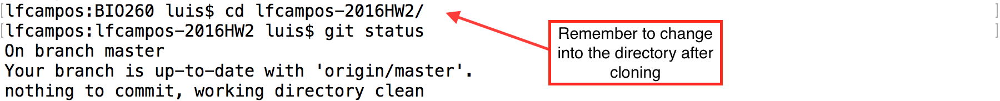
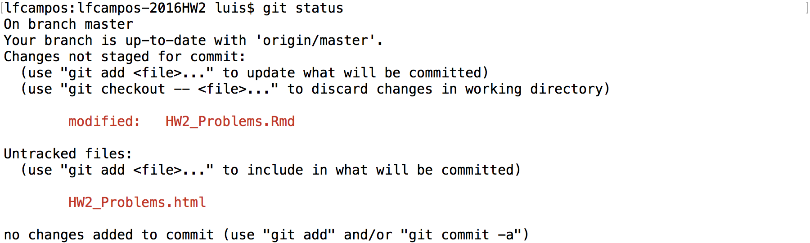
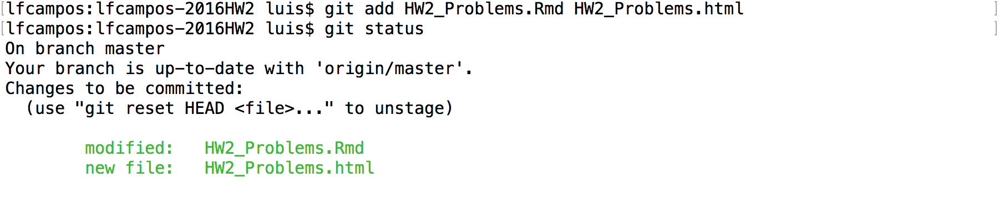
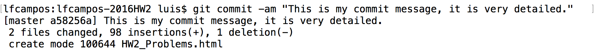
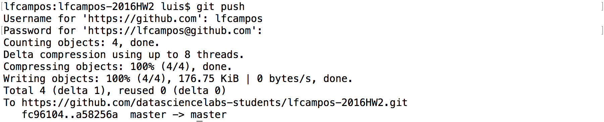
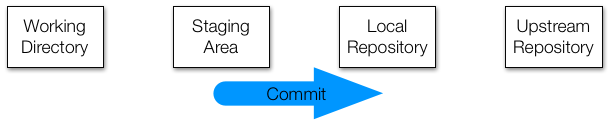

Starting with homework 2 in BIO 260 and CSCI E-107, we will be using 
git and GitHub to get your homework assignment, work on your homework, 
and submit your homework solutions. This tutorial will walk you through 
that process using git and GitHub. 

#### Acknowledgements 
This lab is largely taken from the the 
[first CS109 lab in 2015](https://github.com/cs109/2015lab1) which is 
in turn largely taken from 
[IACS's AC 297s](https://github.com/rdadolf/ac297r-tools-tutorial) course, 
and the world keeps turning. 

## Getting and Working on Homework

### Cloning your Homework repository
Each of you will be made members of the [`datasciencelabs-students` 
organization on GitHub](https://github.com/datasciencelabs-students). 
This means is that your homework repositories all technically belong to us. 
But you will be granted unlimited access throughout the course!

 

You will notice when you visit the Data Science Labs' 
[Github page](https://github.com/datasciencelabs-students) that you can 
only see repositories with your GitHub username on them. You will get 
one repository for each homework throughout the semester. When a new 
homework is released you can go to the corresponding repository to 
see what is in store. The work flow will be pretty simple. 

1. Go to: https://github.com/datasciencelabs-students

2. Click on the repository you want to work on. For 
example `<your_GitHub_username>-2016HW2` for Homework 2. 

3. Copy the link near the top of the page.

4. Go to your `Terminal` (on Mac) or `git bash` (on Windows), 
change directories into your BIO 260 folder.

5. Use `git clone` to clone the repository, for example:

> `$ git clone https://github.com/datasciencelabs-students/<your_GitHub_username>-2016HW2.git`

6. You should now see a new directory called `<your_GitHub_username>-2016HW2`. 
Move into that directory. 

7. If you type `git status` it will give you the current status of your 
directory. It should look something like this:

 

### Working on your homework

Once you have a local copy of your repository, it's time to get to work! 

After writing some of your homework in an `Rmd` file, then `knit` it, 
make pretty plots, find out some cool stuff about the dataset it's 
time to `add/commit/push`. After some work if you head back to `Terminal` 
you will see that something has changed when you type `git status`:

 

You will notice that there are two `untracked files`, these are here 
because I created these two files in the homework repository. 
In order to get git to track changes on these files we need to 
add them. So we type :

> `$ git add HW2_Problems.Rmd HW2_Problems.html `

 

Now you will notice that the files have turned green and are now 
labeled as changes to be committed, now it's time to commit. 
This is equivalent to `save` in most programs. But what is special 
about `git` and other version control software is that we can track 
and revert changes! We also need to give what's called a `commit message`, 
which will help us keep track of the changes we made when we loot at 
this in the future. Leave detailed messages so that future you will 
know what you did. Future you will thank you. We will get to this 
part later. Notice the `-am` flag, the `a` stands for *all*, 
as in all tracked files, and the `m` stands for *message*.

We do that by typing:

``
git commit -am "This is my commit message, it is very detailed."
``

 

Cool! Now we've saved our work on our local directory, we can now push 
our work to Github. Note, we can (and should) do this as many times as 
we want before the homework deadline. What is great about this is that 
it will make getting help from your TA easier as well as keeping a 
copy of your work in the cloud in case your computer crashes, or you 
accidentally delete something.	

 

### Summary
To summarize, it is important to do the following 
steps whenever you finish working on your homework to make full 
use of `git` and Github as well as generally having the best 
experience in this class. 

1. Work on your homework
2. Add changes to track with: `git add`
3. Commit changes to your local repository: `git commit`
4. Push the changes to your github repo: `git push`

Generally keep this picture in mind whenever you want to do this 
loop, it is important to only add changed files you care about 
and nothing you do not care about. If certain files keep popping 
up in your git status that you will never want to add, e.g. `.Rhistory`, 
etc, add them to your `.gitignore` to simplify your life, this will keep 
those files from showing up here. For more info on this see the 
`version_control.Rmd`

# Late Day Policy
From the course web-page:

> Each student is given six late days for homework at the beginning of the semester. A late day extends the individual homework deadline by 24 hours without penalty. No more than two late days may be used on any one assignment. Assignments handed in more than 48 hours after the original deadline will not be graded. We do not accept any homework under any circumstances more than 48 hours after the original deadline. Late days are intended to give you flexibility: you can use them for any reason no questions asked. You don't get any bonus points for not using your late days. Also, you can only use late days for the individual homework deadlines all other deadlines (e.g., project milestones) are hard.

We made this policy because we understand that you are all busy 
and things happen. We hope that this added flexibility makes gives you 
the freedom to enjoy the courses and engage with the material fully. 

## Some unsolicited advice

To be fair to all the students we have to enforce this late day policy, 
so we have put together a list of things to consider near the deadline.

Say the homework is due Sunday at 11:59 pm.

1. If we do not see any more `commit`s after the deadline we will take 
the last `commit` as your final submission.
2. Check that the final `commit` is showing on your Github repo page. 
"I forgot to `push`" is not an acceptable excuse for late work.
3. It may help to add a message like "This is my final version of the 
homework please grade this" but that's up to you.
4. If there are `commit`s after the deadline **we will take the last `commit`**
up to Tuesday at 11:59 pm as the final version. 
5. We will assess the number of late days you used and keep track.
6. You **do not** need to tell us that you will take extra days, we will 
be able to see the time stamp of your last `commit`.
7. When you are done with the homework, do not `commit` or `push` any more. 
If you `commit` and `push` after the deadline you will be charged a late day. 
This is strict.

# Happy `git`-ing