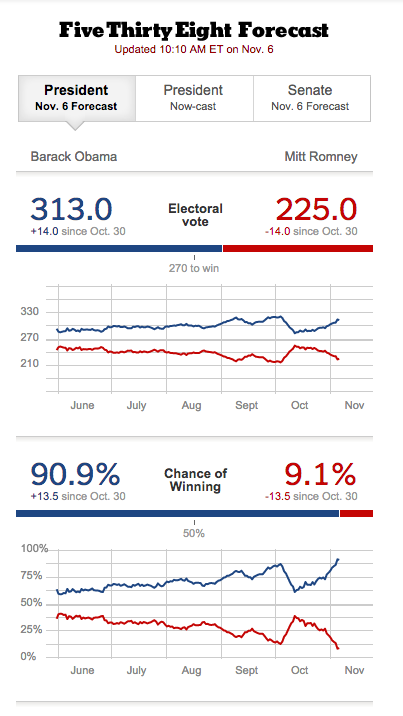
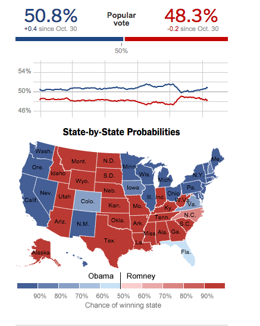

# Probability and Inference

Before we start today's lecture please complete the following probability assessment: 

[http://goo.gl/forms/St2D6YJxUO](http://goo.gl/forms/St2D6YJxUO).

You are not being tested for grade. In fact, we won't record your name. We simply want to adapt the lecture based on your knowledge. If you don't know the answer to a question simply chose the "I would like a review".

## Motivation

In 2012, Nate Silver [declared](http://fivethirtyeight.blogs.nytimes.com/fivethirtyeights-2012-forecast/?_r=0) that Barack Obama had a 91% chance of winning the election. 

  |  

Several pundits were not happy. Here is what Joe Scarborough had to say:

> Anybody that thinks that this race is anything but a tossup right now is such an ideologue, they should be kept away from typewriters, computers, laptops and microphones for the next 10 days, because they’re jokes. 


To support this, you could easily cherry pick from the polls at the time:

```{r, echo=FALSE, cache=TRUE, warning=FALSE, message=FALSE}
library(ggplot2)
library(dplyr)
library(tidyr)
library(pollstR)

theme_set(theme_bw())

race2012 <- pollstr_polls(topic = '2012-president', after= as.Date("2012-11-3"), max_pages = Inf)

polls <- race2012$questions %>% 
  filter(topic=="2012-president" & state=="US") %>% 
  select(choice, value, margin_of_error, observations, id) %>% 
  filter(choice %in% c("Obama","Romney")) %>% 
  spread(choice, value) %>% 
  left_join(select(race2012$polls, id, pollster, method), by="id") %>%
  filter(method!="Internet") %>%
  mutate(diff= Obama - Romney) %>%
  select(pollster, diff, Obama, Romney, margin_of_error, observations)

arrange(polls,diff) %>% rename( n=observations) %>% 
  mutate(pollster=ifelse(pollster=="PPP (D-Americans United for Change)","PPP",pollster))
polls %>% 
  mutate(margin_of_error=ifelse(is.na(margin_of_error),0,margin_of_error)) %>%
  arrange(diff) %>% 
  ggplot( aes(seq_along(diff), Obama-Romney, 
              min=diff-2*margin_of_error,
              max=diff+2*margin_of_error,
              color=pollster)) + 
  geom_point() + geom_errorbar() + 
  xlab("") + 
  theme(axis.ticks = element_blank(),
        axis.text.x = element_blank())

```

Not only did Nate Silver correctly predict that Obama would win, but he also predicted the outcome of all 50 states and DC correctly. Here we will explain how  poll aggregators use Data Science to make these prediction. Our first step is to understand probability. We will learn what _margin of error_ means and why there is variability between different polls.

## Relative Frequency

The word probability is used in everyday language. For example Google's auto-complete of "What are the chances of" give us "getting pregnant", "having twins", and "rain tomorrow". Answering questions about probability is not easy if not impossible. Here we discuss a mathematical definition of _probability_ that does permit us to give precises answers to certain questions. 

For example, if I have 2 red beads and 3 blue beads in a bag and I pick one  at random what is the probability of picking a red one? The answer is 2/5 or 40%. This can be considered a definition: The probability of an event happening is the proportion of times it happens if we repeat the choice over and over independently and under the same condition.


### Notation

We use the notation $\mbox{Pr}(A)$ to denote the probability of event $A$ happening.  In data science applications, we will often deal with continues variables and events will of the form $\mid X \mid a$, in other words the event is that an observed random quantity is larger than a constant $a$. We will say more on this below.


## Monte Carlo Simulations

Computers provide a way to actually perform the experiment described above. Random number generators permit us to mimic the process of picking at random. An example is the `sample` function in R. Here is the example above. We first use the function `rep` to generate the beads.

```{r}
beads <- rep( c("red", "blue"), times = c(2,3))
```

To pick a bead at random we simply type

```{r}
sample( beads, 1)
```

Now, above we used the phrase "over and over". Technically, we can't repeat this over and over, but we can repeat the experiment a large enough number of times to make it practically equivalent. This is referred to as a _Monte Carlo_ simulation. The `replicate` function permits us repeat the same task, say, $B$ times:

```{r}
B <- 10^5
events <- replicate( B, sample( beads, 1))
```

We can now see if in fact, our definition is in agreement with this simulation. We introduce a two new useful functions, `table` and `prop.table`. The function `table` quickly tabulates the outcomes

```{r}
tab <- table(events)
tab
```

and `prop.table` gives us the proportions:

```{r}
prop.table(tab)
```

Now, before we continue, let's point out that `sample` can pick more than one element. However, this selection occurs   _without replacement_.  Note what happens when we ask to select five beads:

```{r}
sample(beads, 5)
sample(beads, 5)
```

This results in a re-arrangement since once one bead is selected it is not returned. So all beads appear at the end. To repeat the same experiment of picking one out of 5, over and over, we need to sample _with replacement_. We can tell `sample` to do this as many times as we want:

```{r}
events <- sample(beads, B, replace = TRUE) ##default is FALSE
prop.table( table( events ) )
```

This code is equivalent to what we did above with `replicate`. When the same exact experiment is conducted and when one outcome does not affect the other, we say that the events are _indepenent_. 


## Probability Distributions

We previously described distributions. In particular we defined the height distribution for our class. There is a connection between distributions and probabilities. We introduced the empirical cumulative distribution function and the notation $F(a)$, which represents the proportion of values in our list below or equal to a value $a$. Suppose our list of numbers is:

```{r}
x <- as.numeric(beads == "blue")
x
```

We can quickly see that, for example $F(0) = 2/5$:

```{r}
mean(x <= 0)
```


If we pick an element at random from this list:

```{r}
X <- sample(x,1)
```

then intuitively we see that the probability of the observed value $X$ being smaller or equal to $0$ is $\mbox{Pr}(X \leq 0) = \mbox{Pr}(X = 0) = F(0)$. We also see that
$\mbox{Pr}(X=1) = F(1) - F(0) = 3/5$. The cumulative distribution function defines the probabilities of elements picked at random from that list.

Assessment: If we pick a random student from this class at random, what is the probability that this student is taller than 6 feet tall? 

```{r,echo=FALSE, warning=FALSE}
##Your code here
```

Note that for categorical outcomes, such as blue and red beads, the concept of a cumulative distribution function is not very intuitive. This is particularly true when we have more than two outcomes. Instead, it is more natural to define the probability of each possible event: $\mbox{Pr}(\mbox{blue bead})=3/5$ and $\mbox{Pr}(\mbox{red bead})=2/5$.


## Conditional Probabilities

An important concept that will we will start seeing more and more relates to _conditional_ distributions and probabilities. We start with an example.

Assessment: 

1. I have a deck of cards. I take two cards (without replacement). What is the probability that the first card is the three of hearts ? Using the notation above we write: What is $\mbox{Pr}(\mbox{first card is } 3\heartsuit)$ ?

2. Given that the first card is not the three of hearts what is the probability that the second one is the three of hearts? We introduce new notation:

$$\mbox{Pr}(\mbox{second card is } 3\heartsuit \mid \mbox{first card is not } 3\heartsuit )$$


### `expand.grid` 

Before continuing we quickly introduce the `paste` function which can be quite useful. We use it to create strings by joining smaller strings. For example, if we have the number of suit of card we can get the card name like this:

```{r}
number <- "Three"
suit <- "Hearts"
paste(number, suit)
```

To see why is this useful. We will use the function `expand.grid` to generate all possible combinations. Here is a quick example:

```{r}
expand.grid(letters[1:3], c(2,4))
```

So here is how we generate a deck of cards:
```{r}
suits <- c("Diamonds", "Clubs", "Hearts", "Spades")
numbers <- c("Ace", "Deuce", "Three", "Four","Five", "Six", "Seven", "Eight", "Nine", "Ten", "Jack", "Queen", "King")
deck <- expand.grid( number=numbers, suit=suits)
deck <- paste( deck$number, deck$suit)
```

To answer the first question above we can simply compute
```{r}
mean( deck =="Three Hearts")
```

which is $1/52$. 

Now let's generate all combinations of picking two cards. For this we use the function `permutations`

```{r}
library(gtools)
index <- permutations(52,2)
first_card <- deck[index[,1]]
second_card <- deck[index[,2]]
sum(second_card == "Three Hearts") / 
  sum( first_card != "Three Hearts" )
```

which is $1/51$. 

## Multiplication rule

If we want to know the probability of two events, say $A$ and $B$, occurring, we can use the multiplication rule

$$ \mbox{Pr}(A \mbox{ and } B) = \mbox{Pr}(A)\mbox{Pr}(B \mid A)
$$

We can use induction to expand for more events:

$$ \mbox{Pr}(A \mbox{ and } B \mbox{ and } C) = \mbox{Pr}(A)\mbox{Pr}(B \mid A)\mbox{Pr}(C \mid A \mbox{ and } B)
$$


Above we mentioned _inpendent_ events. Using mathematical notation we can define $B$ as being independent from $A$ as

$\mbox{Pr}(B \mid A) = \mbox{Pr}(B)$

When we have independent events then the multiplication rule becomes simpler:

$$ \mbox{Pr}(A \mbox{ and } B \mbox{ and } C) = \mbox{Pr}(A)\mbox{Pr}(B)\mbox{Pr}(C)
$$

But we have to be very careful here, as assuming independence can result in very different answers than when we don't.


### Birthday Problem

There are 50 people in this room. What is the chance that at least two people have the same birthday?

We can use a Monte Carlo simulation.

Assessment: Use `sample` to randomly select 50 birthdays. Check if they are unique.

```{r}
##your code here
```

```{r birthday-problem}
compute_prob <- function(n, B=10000){
  same_day <- replicate(B, {
    bdays <- sample(1:365, n, replace=TRUE)
    any(duplicated(bdays))
  })
  mean(same_day)
}
n <- seq(2,60)
prob <- sapply(n, compute_prob)
plot(n, prob)
```

In this case it is much faster to actually do the math. It is also exact so more precise.

Instead of computing the probability of it happening we will compute the probability of it not happening. Let's start with the first person. The probability that person one has a unique birthday is 1. The probability that the second person has a unique birthday, given that person one already took one is 364/365. Then for person three, given the first two have unique birthdays, leaves 363 days to choose from. We continue this way and find the chances of all 50 people having a unique birthday is:

Assessment: Try to compute it using the multiplication rule:

We can write a function that does this for any number.

```{r}
exact_prob <- function(n){
  prob_unique <- seq(365,365-n+1)/365 
  1 - prod( prob_unique)
}
eprob <- sapply(n, exact_prob)
plot(n, prob)
lines(n,eprob)
```


