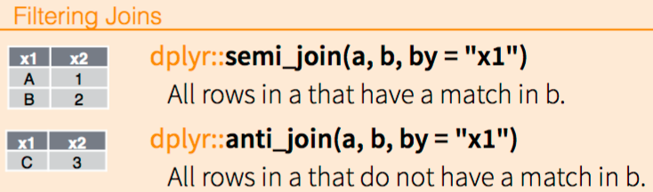

Once data has been transformed into a **tidy** tabular format, an 
important part of "data wrangling" or "data munging" is data transformation. 


We have learned about some functions in the R package `dplyr` that can 
transform and summarize tabular data with rows and columns. 
For example, when data is a tabular format, you have seen how we 
can use `dplyr` to `filter()` rows, `select()` columns and add 
new columns using `mutate()`. Now we will 
explore some more advanced `dplyr` functionality.  

### Brief recap of dplyr

[`dplyr`](http://cran.rstudio.com/web/packages/dplyr/vignettes/introduction.html) 
is a powerful R-package to transform and summarize tabular data with rows 
and columns. 

The package contains a set of functions (or "verbs") to perform common data 
manipulation operations such as filtering for rows, selecting specific 
columns, re-ordering rows, adding new columns and summarizing data. 
In addition, `dplyr` contains a useful function to perform another common task 
which is the is the "split-apply-combine" concept.  We will discuss that in a
little bit. 

# Data

## mammals sleep

The `msleep` (mammals sleep) data set contains the sleeptimes and weights for 
a set of mammals and is available in the [`data` repository on GitHub](https://raw.githubusercontent.com/datasciencelabs/data/master/msleep_ggplot2.csv). 
This data set contains 83 rows and 11 variables.  

To load the `msleep` data set

```{r, message=FALSE, warning=FALSE}
library(readr)
library(dplyr)
library(ggplot2)

msleep <- read_csv("https://raw.githubusercontent.com/datasciencelabs/data/master/msleep_ggplot2.csv")
msleep
```

The columns (in order) correspond to the following: 

column name | Description
--- | ---
`name` | common name
`genus` | taxonomic rank
`vore` | carnivore, omnivore or herbivore?
`order` | taxonomic rank
`conservation` | the conservation status of the mammal
`sleep_total` | total amount of sleep, in hours
`sleep_rem` | rem sleep, in hours
`sleep_cycle` | length of sleep cycle, in hours
`awake` | amount of time spent awake, in hours
`brainwt` | brain weight in kilograms
`bodywt` | body weight in kilograms


# Important `dplyr` verbs to remember

`dplyr` verbs | Description
--- | ---
`select()` | select columns 
`mutate()` | create new columns
`filter()` | filter rows
`arrange()` | re-order or arrange rows
`summarise()` | summarise values
`group_by()` | allows for group operations in the "split-apply-combine" concept


# `dplyr` verbs in action

### `select()` and `mutate`() columns; `filter()` rows

The two most basic functions are `select()` and `filter()` which selects 
columns and filters rows, respectively. The function `mutate()` can be used 
to create new columns. We have already seen examples of all of these
in class. 

For example, to select a range of columns by name, use the ":" (colon) operator

```{r}
msleep %>% select(name:order)
```

To select all columns that start with the character string "sl", use the 
function `starts_with()`

```{r}
msleep %>% select(starts_with("sl"))
```

Some additional options to select columns based on a specific criteria include

1. `ends_with()` = Select columns that end with a character string
2. `contains()` = Select columns that contain a character string
3. `matches()` = Select columns that match a regular expression
4. `one_of()` = Select columns names that are from a group of names


#### Assessment

Select all columns except those from `genus` to `conservation` and 
filter the rows for mammals that sleep a total of more than 16 hours
and have a body weight of greater than 1 kilogram

```{r}
## Provide your code here

msleep %>% 
    select(-(genus:conservation)) %>% 
    filter(sleep_total >= 16, bodywt >= 1)
```

#### Assessment

Create a new column called `rem_proportion` which is the ratio of 
rem sleep to total amount of sleep and create boxplots of the 
`rem_proportion` column split and colored by the `vore` column. 
Create labels for the `x` and `y` axis.  
```{r}
## Provide your code here

msleep %>% 
    mutate(rem_proportion = sleep_rem / sleep_total) %>%
    ggplot(aes(x = vore, y = rem_proportion, fill = vore)) + 
        geom_boxplot() + xlab("Type of diet") + 
        ylab("Proportion") + labs(title = "Proportion of rem sleep")
```


#### Assessment (optional)

Select all columns that start with the character string "sl" or ends
with the character string "wt", create a new
column called `rem_proportion` which is the ratio of rem sleep 
to total amount of sleep, create a second column `bodywt_grams` which
is the bodywt column in grams and filter for the rows 20 to 30 in 
the msleep data set by numerical position. 

Hint: Look at the `slice()` help file to filter for rows by numerical 
position. 

```{r}
## Provide your code here

msleep %>% 
    select(starts_with("sl"), ends_with("wt")) %>%
    mutate(rem_proportion = sleep_rem / sleep_total, 
           bodywt_grams = bodywt * 1000) %>%
    slice(20:30)
```


### Arrange or re-order rows using `arrange()`

To arrange (or re-order) rows by a particular column such as the taxonomic
order, list the name of the column you want to arrange the rows by

```{r}
msleep %>% 
    arrange(order)
```


#### Assessment

Select all columns names with the characters "sleep" and arrange the rows 
for the `sleep_rem` in a decreasing order.

Hint: look at the `?arrange` help file for the `desc()` option.

```{r}
## Provide your code here

msleep %>% 
    select(matches("sleep")) %>% 
    arrange(desc(sleep_rem))
```

#### Assessment

Select three columns from `msleep` (`name`, `order`, `sleep_total`), 
arrange the rows in the `sleep_total` column in a descending order, and 
filter the rows for mammals that sleep for a total of 16 or more hours. 

```{r}
## Provide your code here

msleep %>% 
    select(name, order, sleep_total) %>%
    arrange(order, desc(sleep_total)) %>% 
    filter(sleep_total >= 16)
```


### Create summaries of the data frame using `summarise()`

The `summarise()` function will create summary statistics for a given column 
in the data frame such as finding the mean. For example, to compute the 
average number of hours of sleep, apply the `mean()` function to the 
column `sleep_total` and call the summary value `avg_sleep`. 

```{r}
msleep %>% 
    summarise(avg_sleep = mean(sleep_total))
```

There are many other summary statistics you could consider such `sd()`, 
`min()`, `max()`, `median()`, `sum()`, `n()` (returns the length of vector), 
`first()` (returns first value in vector), `last()` (returns last value in 
vector) and `n_distinct()` (number of distinct values in vector). 


#### Assessment

Summarize `sleep_total` column in the `msleep` data set with the 
average sleep, the minimum and maximum amount of sleep, and the 
total number of mammals. 

```{r}
## Provide your code here

msleep %>% 
    summarise(avg_sleep = mean(sleep_total), 
              min_sleep = min(sleep_total),
              max_sleep = max(sleep_total),
              total = n())
```

    
### Group operations using `group_by()`

The `group_by()` verb is an important function in `dplyr`. As we mentioned 
before it's related to concept of "split-apply-combine". We literally want to 
split the data frame by some variable (e.g. `vore`), apply a 
function to the individual data frames and then combine the output. 

Say we wanted to calculate the standard deviation of the body 
and brain weights for each of factor in the `vore` column.  First, we can 
look at the types of factors in the `vore` column
```{r}
table(msleep$vore)
```

Then, we could use `filter()` to filter for rows that contain "carni" in the 
`vore` column and summarize with the mean of the brain and body
weights. 
```{r}
msleep %>% 
    filter(vore == "carni") %>% 
    summarize("bodywt_sd" = mean(bodywt), 
              "brainwt_sd" = mean(brainwt, na.rm = TRUE))
```

We could repeat this for each factor in `vore`, which is a bit teadious.
Instead, we could use this using the `group_by()` function. 

Let's do that: split the `msleep` data frame by the `vore` column, 
then calculate the mean of body weight and brain weight 
for each invididual data frame. (hint: We expect a set of summary 
statistics for each level in `vore`.)

```{r}
msleep %>% 
    group_by(vore) %>%
    summarize("bodywt_sd" = mean(bodywt), 
              "brainwt_sd" = mean(brainwt, na.rm = TRUE))
```


#### Assessment

Split the `msleep` data frame by the taxonomic order, then for each 
taxonomic order summarize the `sleep_total` with the average sleep, 
the minimum and maximum amount of sleep, and the total number of mammals
in each order. 

```{r}
## Provide your code here

msleep %>% 
    group_by(order) %>%
    summarise(avg_sleep = mean(sleep_total), 
              min_sleep = min(sleep_total), 
              max_sleep = max(sleep_total),
              total = n())
```


# joining two data frames in `dplyr`

The last part of `dplyr` that we will discuss are a set of `dplyr` 
verbs that allow you to join two data sets. The following are cartoons
extracted from [Data Wrangling with dplyr and tidyr Cheatsheet from RStudio ](https://www.rstudio.com/wp-content/uploads/2015/02/data-wrangling-cheatsheet.pdf)
to illustrate the different ways to join data frames using `dplyr`. 


### Two types of functions to join together data frames





## Data

For this section, we will work with two small data sets related to the 
2016 Oscars Nominations. The two data sets are `oscars` and `movies`.  The 
first data set contains information about the the name of the actor/actress,
the name of the movie and the category for nomination.  The second 
data set contains a list of movies and the length of the movie in minutes. 

We will explore the `dplyr` verbs to join the two tables.  First let's load
the data. 

```{r}
library(readr)

oscars <-"
name,movie,category
Adam McKay,The Big Short,Best Director
Alejandro González Iñárritu,The Revenant,Best Director
Lenny Abrahamson,Room,Best Director
Tom McCarthy,Spotlight,Best Director
George Miller,Mad Max: Fury Road,Best Director
Bryan Cranston,Trumbo,Best Actor
Matt Damon,The Martian,Best Actor
Michael Fassbender,Steve Jobs,Best Actor
Leonardo DiCaprio,The Revenant,Best Actor
Eddie Redmayne,The Danish Girl,Best Actor
Cate Blanchett,Carol,Best Actress
Brie Larson,Room,Best Actress
Jennifer Lawrence,Joy,Best Actress
Charlotte Rampling,45 Years,Best Actress
Saoirse Ronan,Brooklyn,Best Actress
"
oscars <- read_csv(oscars, trim_ws = TRUE, skip = 1)
oscars 

movies <-"
movie,length_mins
The Big Short,130
Star Wars: The Force Awakens,135
Brooklyn,111
Mad Max: Fury Road,120
Room,118
The Martian,144
The Revenant,156
Spotlight,128
"
movies <- read_csv(movies, trim_ws = TRUE, skip = 1)
movies 
```

### inner_join(x,y)

This function joins all rows from x where there are matching 
values in y, and all columns from x and y. If there are multiple matches
between x and y, all combination of the matches are returned.

```{r}
inner_join(oscars, movies, by = "movie")
```


### semi_join(x,y)

This function returns all rows from x where there are matching values 
in y, keeping just columns from x. A semi join differs from an 
inner join because an inner join will return one row of x for 
each matching row of y, where a semi join will never duplicate 
rows of x.

```{r}
semi_join(oscars, movies, by = "movie")
```

#### Assessment 

Try applying the `semi_join()` function with `x=movies` and `y=oscars`. 
What is the difference? 

```{r}
## Provide your code here 

semi_join(movies, oscars, by = "movie")
```


### Assessment 

Using the `dplyr` join functions, combine the columns from the 
`oscars` and `movies` data sets and return all rows from the `oscars` data 
set and all columns in both the `oscars` and `movies` columns. 

Hint: read the help file for `left_join()` or `right_join()`. 

```{r}
## Provide your code here

left_join(oscars, movies, by = "movie")
## or 
right_join(movies, oscars, by = "movie")
```

Why are there NAs? 


### Assessment

Using the `dplyr` join functions, combine the columns from the 
`oscars` and `movies` data sets and return all rows from the `movies` data 
set and all columns in both the `oscars` and `movies` columns. 

```{r}
## Provide your code here

right_join(oscars, movies, by = "movie")
## or 
left_join(movies, oscars, by = "movie")
```


### full_join(x,y)

This function returns all rows and all columns from both x and y. 
When there are not matching values, it will return NA for the one missing. 

```{r}
full_join(oscars, movies, by = "movie")
full_join(movies, oscars, by = "movie")
```

### Assessment

Using the `dplyr` join functions, return all rows from `oscars` data set 
where there are not matching values in `movies`, only keeping the 
columns from the `oscars` data set.

Hint: Read the help file for `anti_join()`. 

```{r}
## Provide your code here

anti_join(oscars, movies, by = "movie")
```


### Other functions in `dplyr` to join together data frames 


# Cheatsheets

* [Data Wrangling with dplyr and tidyr from RStudio](https://www.rstudio.com/wp-content/uploads/2015/02/data-wrangling-cheatsheet.pdf)


